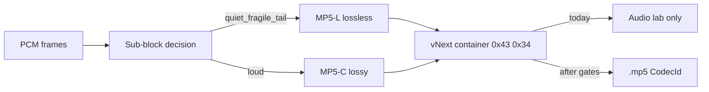

# MP5 Hiss Fix, Compression Upgrade, and Website Improvements

## What we already know (do not re-audit from scratch)

Root cause is documented in [docs/MP5C_HISS_AUDIT.md](docs/MP5C_HISS_AUDIT.md): **MP5-C quantizes time-domain samples with a full-scale-relative step**, so quiet/reverb passages become broadband hiss. MP5-L is clean and default; current MP5-C can even be *larger* than MP5-L on real music while still hissing.

A working fix already exists as **vNext “smooth”** ([rust/mp5-codec/src/mp5c2.rs](rust/mp5-codec/src/mp5c2.rs)): hybrid lossless fallback (MP5-L) for quiet/fragile/decaying sub-blocks + MP5-C for loud ones. Synthetic `reverb_tail` is already **hiss risk low** (bit-exact quiet/tail windows). It is **lab-only** (`0x43 0x34` magic, no `CodecId`, not in Converter, not written to `.mp5`).

**Default approach for this workstream:** follow the repo’s existing quality-first policy ([docs/MP5C_VNEXT_PLAN.md](docs/MP5C_VNEXT_PLAN.md)) — finish open vNext size work and real-track validation, then wire a gated export path; improve MP5-L compression in parallel; do **not** start a from-scratch MDCT redesign in this phase.

---

## Skills that help this project

No dedicated “lossy audio codec / psychoacoustics” skill exists on [skills.sh](https://skills.sh/). Use these high-install skills for the engineering workflow and website track:

| Skill                                                          | Why                                                              | Install                                                                     |
| -------------------------------------------------------------- | ---------------------------------------------------------------- | --------------------------------------------------------------------------- |
| `vercel-labs/agent-skills@vercel-react-best-practices` (~547K) | Converter/player React perf, cold-load                           | `npx skills add vercel-labs/agent-skills@vercel-react-best-practices -g -y` |
| `vercel-labs/agent-skills@web-design-guidelines` (~459K)       | Hosted demo / landing polish                                     | `npx skills add vercel-labs/agent-skills@web-design-guidelines -g -y`       |
| `vercel-labs/agent-skills@vercel-composition-patterns` (~247K) | Split simple vs advanced Converter composition                   | `npx skills add vercel-labs/agent-skills@vercel-composition-patterns -g -y` |
| `anthropics/skills@frontend-design` (~657K)                    | Visual hierarchy for codec warnings / demo                       | `npx skills add anthropics/skills@frontend-design -g -y`                    |
| `anthropics/skills@webapp-testing` (~114K)                     | Playwright regression for Converter codec gating                 | `npx skills add anthropics/skills@webapp-testing -g -y`                     |
| `obra/superpowers@systematic-debugging` (~183K)                | Hiss regressions measured, not guessed                           | `npx skills add obra/superpowers@systematic-debugging -g -y`                |
| `obra/superpowers@verification-before-completion` (~142K)      | Require `pnpm audio:hiss-report` / quality gates before shipping | `npx skills add obra/superpowers@verification-before-completion -g -y`      |
| `obra/superpowers@test-driven-development` (~163K)             | Bit-exact / SNR gate tests first for coalescing                  | `npx skills add obra/superpowers@test-driven-development -g -y`             |

Already available locally (use them): Claude `accessibility`, `webapp-testing`, `frontend-design`; Cursor Vercel React/composition skills; Superpowers debugging/verification.

**Install the missing ones first** when implementation starts (especially web-design-guidelines, systematic-debugging, verification-before-completion if not already global).

---

## Status update (2026-07-17)

Landed on `main` (`25cb761`, `86501d4`):

- **Phase 1 (hiss)**: lossy sub-block coalescing in Rust `mp5c2` + JS lab (bit-identical); synthetic `reverb_tail` hiss risk **low**; `dense_music` ~1.17× → ~0.97× PCM. Real-track gate via `pnpm audio:validate-vnext-ref`: tail SNR **~32.6 dB (medium)** — better than MP5-C (~25 dB) but **not** the ≥40 dB "low" gate.
- **Phase 2 Track B (partial)**: `CodecId.MP5C2 = 5` wired through container/Converter/player, gated behind the lab/advanced toggle; batch stays MP5-L.
- **Phase 2 Track A (partial)**: MP5-L silence-aware block planning + stronger M/S heuristic (bit-exact gates green). LPC order stays at 4 (order 8 overflowed; reverted).
- **Phase 3 (website)**: codec hierarchy optgroups + advanced toggle + warnings; WASM cold-load progress; Playwright coverage (5 passing).

Remaining work is the compression phase below.

---

## Phase 4 — Quality-preserving compression (current phase)

**Verified finding:** `FLAG_RICE = 3` in [rust/mp5-codec/src/mp5l/block.rs](rust/mp5-codec/src/mp5l/block.rs) is misnamed — its payload is LPC residuals written as **varint zigzag** (≥1 byte per residual). A complete bit-packed Rice codec already exists in [rust/mp5-codec/src/mp5l/rice.rs](rust/mp5-codec/src/mp5l/rice.rs) (`rice_encode`/`rice_decode` + partitioned variants over `BitWriter`/`BitReader`) but is only used by `diag.rs` for estimation — never wired into the payload path. Wiring it in is the highest-value safe size win: MP5-L already does per-block try-all-flags selection guarded by `payload_roundtrips(...)`, so a new flag slots straight in and lossless verification makes quality regression structurally impossible.

### Phase 4.0 — Baselines + Rice go/no-go measurement (do first)

1. Lock baselines: `pnpm bench:mp5l-compression`, `pnpm audio:hiss-report`, `pnpm audio:validate-vnext-ref`, `pnpm audio:null-test`. Record numbers.
2. **Go/no-go for the Rice ticket:** on the bench corpus, compare projected bit-packed Rice size (`rice_estimate_bits_partitioned`, already available near `diag.rs`) vs actual `FLAG_RICE` varint payload bytes. If projected saving < ~3–5%, deprioritize 4.1 and move 4.3 (4-mode stereo) up.

### Phase 4.1 — Wire bit-packed Rice into MP5-L (if go)

- New block flag (e.g. `FLAG_RICE_PACKED`) using `rice_encode_partitioned` / `rice_decode_partitioned`; keep legacy varint flag for compat. Encoder picks the smaller verified payload per block.
- **Format compat:** new-flag files won't decode on older builds — bump the format/compat notes, and add a decoder-accepts-both (old varint + new packed) test.
- **Decode safety is part of definition-of-done:** the Rice decoder becomes a real (incl. WASM/browser) decode path. Required tests: roundtrip property test + garbage-input-never-panics (fuzz/property style; `rice_decode` unary guard caps runs at 1M but must be exercised). Use the Trail of Bits property-based-testing skill if installed.

### Phase 4.2 — Rice-cost-aware selection

- Make `best_order` / k selection cost-aware against actual Rice bits (not varint bytes). Bit-exact gates must stay green.

### Phase 4.3 — FLAC-style 4-mode stereo

- Try L/R, L/S, R/S, M/S per block; pick smallest verified. Same roundtrip-verify-before-commit pattern.

### Phase 4.4 — vNext real-track gate (timeboxed experiment, not a chase)

- Goal: tail SNR ≥ 40 dB on the real reference by **widening** lossless protection (accept size cost). Sequencing matters: do quality *before* any further vNext size tuning, because lossless routing couples SNR and bytes — size-first locks thresholds that cap SNR.
- **Timebox:** a fixed budget of threshold configurations (measure each with `pnpm audio:validate-vnext-ref`), then a verdict. Expected outcome may be a **wall**: 40 dB on real decaying tails likely isn't reachable with time-domain quant without approaching 1× PCM. "Can't reach ≥40 dB without >1× PCM, documented" is a valid, honest exit — record it in `MP5C_VNEXT_RESULTS.md` and stop.
- Only if green: unlock vNext size-at-fixed-quality work.

### Phase 4 gates

- Always: `pnpm audio:gates` (MP5-L bit-exact, vNext quiet/silence, policy tests)
- Size: `pnpm bench:mp5l-compression` vs 4.0 baseline; must be smaller with all gates green
- vNext: `tailSnrDb ≥ 40` for "low"; never judge on full-song SNR alone
- Property/fuzz tests for any new decode path

### Phase 4 non-goals

- No MP5-C v5.1 quant/layout changes; no default flip away from MP5-L
- No MDCT/psychoacoustic redesign; no re-attempt of JS noise-shaping
- No LPC order > 4; no vNext size targets before the 40 dB verdict
- No MP5-H size work (escape hatch, not a compression path)

---

## Phase 1 — Fix hiss (codec), keep quality gates honest

Work in [rust/mp5-codec/src/mp5c2.rs](rust/mp5-codec/src/mp5c2.rs) and [tools/audio-lab/codecs.mjs](tools/audio-lab/codecs.mjs); measure with `pnpm audio:hiss-report`.

1. **Coalesce adjacent lossy sub-blocks** (the open item in the vNext plan). Today each lossy 1024-sample sub-block pads to MP5-C’s 2048 frame → loud material can exceed 1× PCM. Merge consecutive `TAG_LOSSY` runs into full MP5-C frames, re-measure RMS/quality (this *does* change frame stats — treat as a measured experiment, not a free win).
2. **Keep JS lab and Rust bit-identical** after coalescing (parity SNR = ∞), same pattern used for the v0.25 port.
3. **Validate on real fades/reverb** via Audio Quality Lab local reference (not committed). Gates from the plan must hold: silence/quiet bit-exact or ≥60 dB; `reverb_tail` quiet ≥40 dB / worst-1s ≥30 dB; commercial-track tail ≥40 dB; no duration drift; no broadband quiet-window flatness.
4. **Do not weaken lab honesty gates** to make numbers look better.

Exit criteria: hiss risk **low** on synthetic + at least one real reference; size on dense/loud fixtures documented and preferably ≤ current smooth Extreme without regressing quiet metrics.

---

## Phase 2 — Upgrade compression (two honest tracks)

### Track A — MP5-L (safe size wins, no quality risk)

MP5-L is the default and already ~0.50× PCM average. Allowed research only if **every bit-exact gate stays green** ([docs/MP5_CODEC_STATUS.md](docs/MP5_CODEC_STATUS.md)):

- Partitioned Rice / adaptive Rice parameter
- Adaptive block size
- Better stereo decorrelation
- LPC order selection / RLE where beneficial

Measure with existing `pnpm bench:mp5l-compression` / quality suite. This is the path that actually “upgrades compression on MP5 files” users export today.

### Track B — Promote vNext only after Phase 1 gates

When gates pass:

1. Assign a public `CodecId` in [packages/mp5-container/src/constants.ts](packages/mp5-container/src/constants.ts) and document the `0x43 0x34` AUDI payload in container/codec specs.
2. Export `encode_mp5c_vnext` / `decode_mp5c_vnext` through the web WASM pkg and [apps/web](apps/web) codec wrapper (today app pkg does not expose them).
3. Wire Converter as **explicit lab/advanced** (not default); keep MP5-L default; batch stays MP5-L.
4. Update player decode path so new files play; keep rejecting cross-decode with old MP5-C.
5. Update [docs/MP5_KNOWN_ISSUES.md](docs/MP5_KNOWN_ISSUES.md), feature matrix, compatibility docs — honest size caveats.

**Out of scope this phase:** MDCT / psychoacoustic redesign (medium-term in the vNext plan). Revisit only if Track B still cannot beat MP5-L on size while staying clean.

---

## Phase 3 — Website / product improvements (parallel, targeted)

Use the Vercel React + composition + web-design skills. Highest leverage, tied to the codec story:

1. **Codec hierarchy UX** in [apps/web/src/player/ConverterPanel.tsx](apps/web/src/player/ConverterPanel.tsx) + [apps/web/src/lib/codecDisplay.ts](apps/web/src/lib/codecDisplay.ts): group **Recommended (MP5-L) / Debug (PCM) / Lab (MP5-C, MP5-H, later vNext)**; require an “Advanced / lab codecs” toggle before MP5-C is selectable so users stop exporting hiss by accident.
2. **Cold-load progress** for WASM + FFmpeg (~31 MB) — clearer early progress in App / WasmSetupBanner ([docs/MP5_KNOWN_ISSUES.md](docs/MP5_KNOWN_ISSUES.md)).
3. **Converter progressive disclosure** — simple path = decode → metadata → MP5-L export; fold stems/AI/lab codecs behind advanced sections ([ConverterPanel.tsx](apps/web/src/player/ConverterPanel.tsx), AI panels).
4. **Mobile density** — stems/lyrics/package scrolling and stem prep progress ([Mp5Player.tsx](apps/web/src/player/Mp5Player.tsx), stems panel).
5. **E2E** — Playwright coverage that default export is MP5-L and lab codecs stay gated.

Do **not** redesign the whole marketing site unless you explicitly expand scope later; focus on friction that blocks listening/export trust.

---

## Verification checklist (before calling any milestone done)

- `pnpm audio:hiss-report` — vNext (and any coalesced variant) hiss risk low; MP5-C baseline still documented as severe for honesty
- Full codec / container regression suites (JS + Rust) — MP5-C v5.1 byte-identical if untouched
- Bit-exact MP5-L gates green if Track A lands
- Manual: Converter default MP5-L; lab codecs gated; new CodecId files play if promoted
- Docs: codec status, known issues, changelog updated with measured numbers only

---

## What we will not do

- Claim MP5 beats MP3/AAC/Opus/FLAC/WAV
- Make hissy MP5-C the default
- Wire vNext into `.mp5` before real-track gates pass
- Chase size before quiet/tail SNR gates
- Bolt-on JS noise-shaping (already measured worse and rejected)

