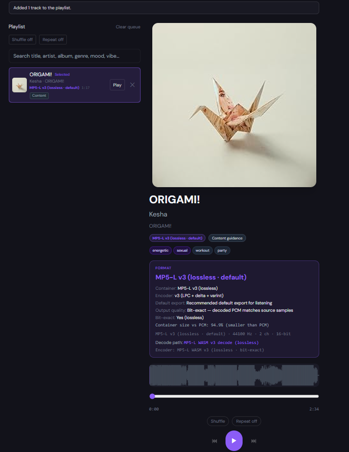
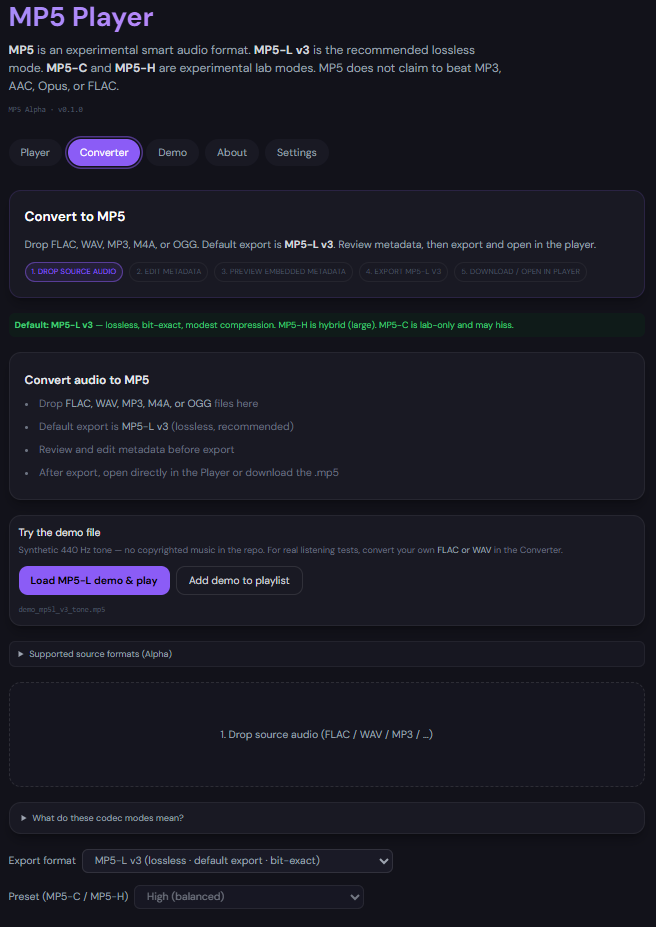
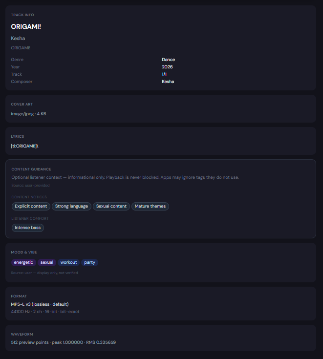

# MP5 Audio

[](https://github.com/cjocollin/MP5-audio/actions/workflows/ci.yml)
[](LICENSE)
[](docs/CURRENT_MP5_STATUS.md)
[](CHANGELOG.md#0154-alpha---2026-05)
[](https://mp5-audio.vercel.app)

An experimental open-source audio format, container, codec, converter, and player project.

**Live demo:** https://mp5-audio.vercel.app · **GitHub:** https://github.com/cjocollin/MP5-audio

**Version:** MP5 Audio **v0.15.4-alpha**

MP5 Alpha uses **MP5-L v3** as the recommended lossless mode. **MP5-C** and **MP5-H** are experimental research modes. **MP5 does not claim to beat MP3, AAC, Opus, or FLAC.** No DRM. Rights metadata is informational only.

**Compatibility toolkit:** [`docs/MP5_CHUNK_REGISTRY.md`](docs/MP5_CHUNK_REGISTRY.md) · [`docs/MP5_COMPATIBILITY_POLICY.md`](docs/MP5_COMPATIBILITY_POLICY.md) · `pnpm inspect:mp5 <file>` · `pnpm validate:mp5 <file>`

**Beta readiness:** [`docs/MP5_BETA_READINESS.md`](docs/MP5_BETA_READINESS.md) · [`docs/MP5_KNOWN_ISSUES.md`](docs/MP5_KNOWN_ISSUES.md) · `pnpm beta:check`

**Contributor docs:** [`CONTRIBUTING.md`](CONTRIBUTING.md) · [`SECURITY.md`](SECURITY.md) · [`CODE_OF_CONDUCT.md`](CODE_OF_CONDUCT.md)

---

## What is MP5?

**MP5** is an experimental open-source audio format, container, codec, converter, and player project. It explores metadata-rich audio packaging, browser playback, Rust/WASM codec work, validation tooling, and developer-facing specs.

In plain terms: **MP5** (`.mp5`) is a smart audio container for music, podcasts, libraries, and apps. It stores audio plus context — metadata, cover art, lyrics, waveform/seek data, optional content guidance, mood/vibe tags, stems, album packages, and room for future interactive audio.

## Current status

| Area | Status |
| ---- | ------ |
| **Overall** | **Alpha / experimental** — research-focused, not production-ready |
| **MP5-L v3** | **Recommended** stable lossless path — bit-exact roundtrip |
| **MP5-C** | **Experimental** — known hiss/artifact limitations; lab-only |
| **MP5-H** | **Experimental** — hybrid + CORR; large files; not default |
| **PCM** | Reference / debug fallback when WASM is unavailable |
| **vs mainstream codecs** | **Not** a replacement for MP3, AAC, Opus, or FLAC yet |

Built for open format exploration, validation tooling, transparent benchmarks, and developer-readable specs — not for untrusted production ingestion today. See [`docs/CURRENT_MP5_STATUS.md`](docs/CURRENT_MP5_STATUS.md).

## Why this project matters

- **Open format experimentation** — container + codec research without lock-in claims
- **Developer-readable specs** — chunk registry, compatibility policy, metadata docs
- **Parser/writer validation** — `inspect:mp5`, `validate:mp5`, golden fixtures, corrupt-input tests
- **Browser-based audio workflows** — convert, play, library, and batch tools in one reference app
- **Rust/WASM media tooling** — native and WASM codec paths with shared test gates
- **Rich metadata packaging** — lyrics, stems, sections, themes, album manifests (optional chunks)
- **Safe parsing mindset** — honest limits, integrity chunks, no DRM theater
- **Transparent benchmarks and limitations** — documented MP5-C hiss, MP5-H size, alpha gaps

### Feature matrix (Alpha)

| Works now (Alpha) | Experimental | Future research |
| --------------- | ------------ | --------------- |
| MP5-L v3 convert and play | MP5-C (may hiss) | Interactive audio features |
| Metadata, cover, lyrics | MP5-H (large files) | Cloud sync / accounts |
| Local library (device-only) | Album packages (`.mp5p`) | Offline polish |
| Content guidance (optional) | Desktop / mobile packaging | Advanced metadata layers |

---

## Codec policy

| Codec | Role |
| ----- | ---- |
| **MP5-L v3** | **Default / recommended** — lossless, bit-exact |
| **PCM** | **Reference / debug** only |
| **MP5-H** | **Hybrid** — clean with CORR; **large**; not default |
| **MP5-C** | **Lab-only** — may **hiss**; not for normal listening |

---

## Screenshots

From the [live Alpha demo](https://mp5-audio.vercel.app) — synthetic demo audio only; no copyrighted album art.

| Player | Converter | Metadata |
| ------ | --------- | -------- |
|  |  |  |

More captures: [`docs/screenshots/`](docs/screenshots/README.md)

---

## Quick start (local)

```bash
pnpm install
pnpm wasm:build    # required for MP5-L — see docs/WASM_SETUP.md
pnpm demo          # http://localhost:5173
```

**Build and test (contributors):**

```bash
pnpm lint              # TypeScript checks
pnpm test              # unit tests (excludes generated-fixture compatibility suite)
pnpm test:unit         # same as pnpm test
pnpm test:compatibility # generate synthetic fixtures + compatibilityPass tests
cargo test -p mp5-codec   # Rust codec tests
pnpm build             # container + web production build
pnpm alpha:check       # full Alpha gate (optional, slower)
```

See [`CONTRIBUTING.md`](CONTRIBUTING.md) for full setup, fixture rules, and PR expectations.

**Try the hosted demo:** open https://mp5-audio.vercel.app → **Try the MP5-L demo** → play synthetic tone (no copyrighted music in repo).

**Convert your own audio:** Converter → drop FLAC/WAV/MP3/M4A/OGG → edit metadata → **Export MP5-L v3** → **Open in Player**.

**Batch convert:** Converter → **Batch** → drop multiple sources → **Start batch** (MP5-L v3 only). Progress per file; download individually or **Download all** (separate files, no ZIP). Optional **auto-save to library** with FING duplicate detection. All processing stays in the browser — large batches can be slow; closing the tab cancels work. Per-file metadata editing uses **Single file** mode.

**Stems (v0.8.2):** Import stems **one-by-one or in batch** (WAV/FLAC/MP3/M4A/OGG); filename-based type guessing; **normalize** rate/duration vs the full mix — see [`docs/MP5_STEMS.md`](docs/MP5_STEMS.md).

**Performance (v0.8):** Settings → **Diagnostics** shows queue size, decode cache, library storage, WASM/FFmpeg status, and conversion activity. Calm warnings appear for very large files, long batches, stem RAM limits, and storage pressure. First load downloads WASM + FFmpeg (~31 MB for non-WAV conversion).

**Local library:** **Library** tab → save `.mp5` files on this device (IndexedDB). Search, play, download again, or add to the player queue. Nothing is uploaded to a server; clearing browser data may remove saved files. Large exports can use significant storage.

**Optional stems:** Converter **Stems** section — add WAV/FLAC stems manually (no AI). Full mix stays in AUDI; **STDA** (small) or **STDF** (large embedded sets). Player uses **lazy stem load** — solo or prepare selected stems; karaoke prefers instrumental-only decode. See [`docs/MP5_STEMS.md`](docs/MP5_STEMS.md).

**Synced lyrics / karaoke:** Optional **LYRC** synced lines (`timeMs`) via converter `[mm:ss.xx]` editor; player lyrics panel + karaoke mode (synced lyrics + stems). No AI lyric generation. See [`docs/MP5_METADATA_SPEC.md`](docs/MP5_METADATA_SPEC.md).

**Song sections:** Optional **SECT** / **HOOK** / **HILT** — manual song map, smart navigation, highlight preview/loop in the player (no clip export). See [`docs/MP5_SECTIONS.md`](docs/MP5_SECTIONS.md).

**Visual themes:** Optional **VISU** — per-file accent colors and mood for the player UI (no effect on audio). See [`docs/MP5_VISUAL_THEMES.md`](docs/MP5_VISUAL_THEMES.md).

**Credits & rights:** Optional **CRDT**, **LICN**, and **IDEN** metadata for credits, license hints, and release IDs — informational only (no DRM or enforcement). See [`docs/MP5_CREDITS_RIGHTS.md`](docs/MP5_CREDITS_RIGHTS.md).

**Fingerprints:** Optional **FING** / **HASH** for duplicate detection and local integrity checks — not DRM or legal proof. See [`docs/MP5_FINGERPRINT_INTEGRITY.md`](docs/MP5_FINGERPRINT_INTEGRITY.md).

**Album packages:** Optional **`.mp5p`** — **manifest** (JSON + sidecar `.mp5` files) or **embedded** (one self-contained package). Polished album view in Player: play, queue, save, extract. Batch album builder exports all three modes. Single-track `.mp5` remains the core format. See [`docs/MP5_ALBUM_PACKAGE.md`](docs/MP5_ALBUM_PACKAGE.md) and [`docs/MP5_EMBEDDED_PACKAGE.md`](docs/MP5_EMBEDDED_PACKAGE.md).

---

## Verification

```bash
pnpm alpha:check          # full Alpha gate
pnpm build
pnpm deploy:check
pnpm vercel:check
```

---

## Deploy

Vercel project **`mp5-audio`** → https://mp5-audio.vercel.app

→ [`docs/MP5_VERCEL_SETUP.md`](docs/MP5_VERCEL_SETUP.md) · [`docs/MP5_DEPLOYMENT_GUIDE.md`](docs/MP5_DEPLOYMENT_GUIDE.md)

---

## Safety and security

MP5 parses binary container and audio data in the browser and CLI tools. The project is **alpha** — do not treat untrusted `.mp5` / `.mp5p` files as safe for production ingestion yet.

Report crashes, hangs, memory exhaustion, or validation bypasses **privately** via [`SECURITY.md`](SECURITY.md) (GitHub Security Advisories).

---

## Contributing

Contributions welcome — especially validation, docs, fixtures, and MP5-L stability. Read [`CONTRIBUTING.md`](CONTRIBUTING.md) and [`CODE_OF_CONDUCT.md`](CODE_OF_CONDUCT.md) before opening a PR.

---

## Alpha roadmap

Realistic near-term goals (not adoption or production promises):

- Stabilize **MP5-L v3** encode/decode and compression research
- Improve parser validation and corrupt-input coverage
- Expand synthetic fixtures and CI gates
- Document chunk specs and compatibility profiles
- Continue **MP5-C** research with transparent hiss/limitation reporting
- Revisit **MP5-H** defaults after MP5-C quality improves
- Improve player, converter, batch, and album-package UX
- Metadata polish, library persistence, offline/PWA polish

Longer-term research: stems, interactive audio, desktop/mobile packaging — see [`docs/MP5_ROADMAP.md`](docs/MP5_ROADMAP.md).

---

## Important limitations

- Experimental Alpha — not production-ready
- Large WASM/FFmpeg download on first visit (~30+ MB precache)
- Browser encode/decode is CPU- and memory-intensive
- MP5-C may hiss; MP5-H files are large
- Playlist file handles are not restored after full page reload
- **MP5 does not claim to beat MP3, AAC, Opus, or FLAC**

---

## Project layout

| Path | Purpose |
| ---- | ------- |
| `apps/web/` | Player + converter + compact public landing (expandable About) |
| `packages/mp5-container/` | `.mp5` parser/writer |
| `rust/mp5-codec/` | MP5-L / MP5-C / MP5-H (WASM) |
| `test-fixtures/` | Synthetic demo tones only |
| `docs/` | Specs, demo guides, deployment |

---

## Docs

- [Contributing](CONTRIBUTING.md)
- [Security policy](SECURITY.md)
- [Changelog](CHANGELOG.md)
- [Release checklist](RELEASE_CHECKLIST.md)
- [Release draft notes (v0.13.0-alpha)](docs/GITHUB_RELEASE_v0.13.0-alpha.md)
- [Public demo copy](docs/MP5_PUBLIC_DEMO_COPY.md)
- [Demo guide](docs/MP5_DEMO_GUIDE.md)
- [Current status](docs/CURRENT_MP5_STATUS.md)
- [Hosted demo](docs/MP5_HOSTED_DEMO.md)
- [Metadata spec](docs/MP5_METADATA_SPEC.md)
- [Roadmap](docs/MP5_ROADMAP.md)

---

## License

[MIT](LICENSE) — experimental research prototype. Copyright (c) 2026 Collin O'Keefe.
