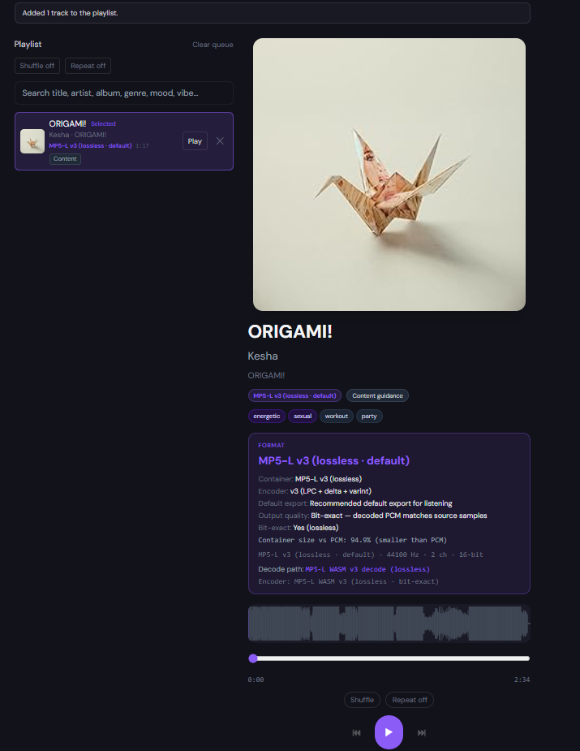
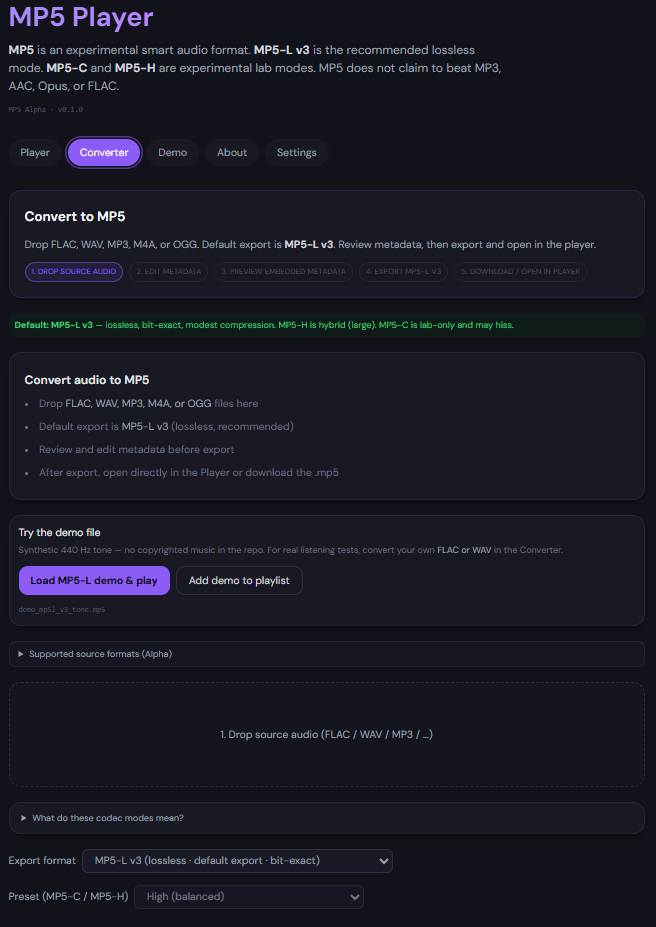
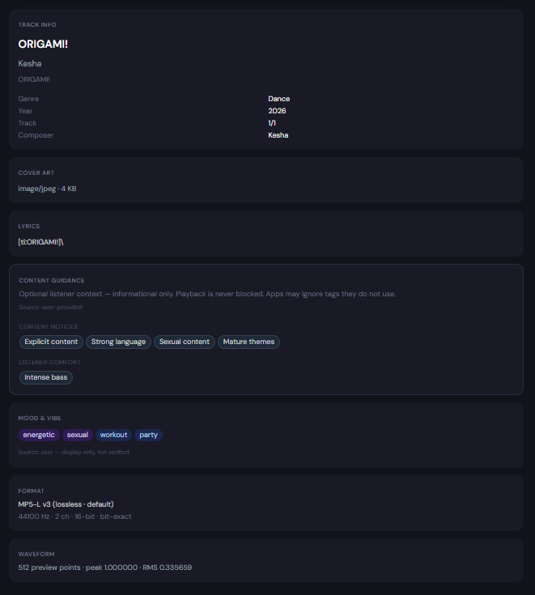

# MP5 Audio

[](https://github.com/cjocollin/MP5-audio/actions/workflows/ci.yml)
[](LICENSE)
[](docs/CURRENT_MP5_STATUS.md)
[](CHANGELOG.md#0301-beta---2026-08-28)
[](https://mp5-audio.vercel.app)

An experimental open-source audio format, container, codec, converter, and player project.

**Version:** MP5 Audio **v0.30.1-beta** (Public Beta)
**Live demo:** https://mp5-audio.vercel.app  
**GitHub:** https://github.com/cjocollin/MP5-audio

MP5 Public Beta uses **MP5-L v4** as the recommended lossless mode. **MP5-C** and **MP5-H** are experimental research modes. **MP5 does not claim to beat MP3, AAC, Opus, or FLAC.** No DRM. Rights metadata is informational only. No telemetry, upload, or cloud sync is added by the reference app.

**Report bugs:** [GitHub Issues](https://github.com/cjocollin/MP5-audio/issues/new/choose) or in the hosted app: **Settings -> Report a bug / Give feedback**. Paste **Settings -> Diagnostics -> Copy diagnostics** if useful; no files are uploaded automatically.

## What Is MP5?

MP5 (`.mp5`) is an experimental smart audio container for browser-based music, podcast, library, and app workflows. It stores audio plus optional context: metadata, cover art, lyrics, waveform/seek data, content guidance, mood/vibe tags, stems, visual themes, integrity metadata, and album packages.

Single-track `.mp5` remains the core format. Album packages use `.mp5p` in either manifest mode (JSON plus sidecar `.mp5` files) or embedded mode (one self-contained binary package).

## Current Status

| Area | Status |
|------|--------|
| Overall | Public Beta / experimental; not production-ready for archival or legal use |
| MP5-L v4 | Recommended lossless path; bit-exact roundtrip (v3 lab/legacy) |
| MP5-C | Lab-only; quiet-passage hiss is measured (see codec status) |
| MP5-C vNext (MP5C2) | Lab/advanced gated export (`CodecId` 5, AUDI `0x43 0x34`); protect 1.5; prefer High preset; not default |
| MP5-H | Experimental hybrid; large (avg >1× PCM); not default |
| PCM | Reference/debug fallback |
| `.mp5p` | Experimental album package; browser memory limits apply |
| Public claims | No beat-codec, DRM, legal-proof, telemetry, upload, or cloud-sync claims |

## v0.30.1-beta Focus

- Installed `.mp5` / `.mp5p` file launches and native media play, pause, seek, previous, and next actions.
- Song-driven VISU colors animate an audio analyser in Now Playing, with a reduced-motion fallback.
- Album creators can opt into decoded-buffer gapless transitions; ordinary queues keep their existing behavior.
- Converter exports can be auditioned against retained source PCM on one synchronized playhead.
- Local Library can verify saved tracks/packages and copy every saved file to a chosen backup folder.

The release adds no new MP5 chunks, codec claims, telemetry, uploads, or cloud sync.

```bash
pnpm audio:hiss-report                       # hiss matrix + Hiss Risk + protected % (git-ignored)
pnpm audio:validate-vnext-ref                # real-track protect-scale gate (needs lab.config)
pnpm audio:export-listening:vnext            # PCM + MP5-L + MP5-C + vNext (smooth/native/...) WAVs
cargo test -p mp5-codec --release            # native codec tests (incl. mp5c2 + MP5-C-unchanged)
```

## Developer Toolkit

- [Developer quickstart](docs/MP5_DEVELOPER_QUICKSTART.md)
- [Compatibility matrix](docs/MP5_COMPATIBILITY_MATRIX.md)
- [Fixture catalog](docs/MP5_FIXTURE_CATALOG.md)
- [Chunk registry](docs/MP5_CHUNK_REGISTRY.md)
- [Format spec](docs/MP5_FORMAT_SPEC.md)
- [Container spec](docs/MP5_CONTAINER_SPEC.md)
- [Metadata spec](docs/MP5_METADATA_SPEC.md)
- [Audio quality lab](docs/MP5_AUDIO_QUALITY_LAB.md)
- [Codec status](docs/MP5_CODEC_STATUS.md)
- [MP5-C hiss audit](docs/MP5C_HISS_AUDIT.md)
- [MP5-C vNext plan](docs/MP5C_VNEXT_PLAN.md)
- [MP5-C vNext results](docs/MP5C_VNEXT_RESULTS.md)
- [Known issues](docs/MP5_KNOWN_ISSUES.md)

CLI tools:

```bash
pnpm inspect:mp5 <file.mp5|file.mp5p>
pnpm validate:mp5 <file.mp5> --profile playable
pnpm validate:mp5p <file.mp5p> --profile package
```

Profiles: `basic`, `playable`, `rich`, `strict`, `package`.

## Quick Start

```bash
pnpm install
pnpm wasm:build
pnpm demo
```

Local demo: http://localhost:5173

Contributor gates:

```bash
pnpm lint
pnpm test
pnpm test:compat
CI=1 pnpm test:e2e
pnpm playback:check
CI=1 pnpm beta:check
CI=1 pnpm beta:check
pnpm build
pnpm deploy:check
```

Audio quality lab (synthetic fixtures; no copyrighted audio, no telemetry):

```bash
pnpm audio:gates            # codec quality gates (also part of pnpm test)
pnpm audio:bench            # full bench → benchmarks/audio-quality/ (git-ignored output)
pnpm audio:quality-report
```

See [CONTRIBUTING.md](CONTRIBUTING.md) for full setup, fixture rules, and PR expectations.

## Hosted Demo Paths

- Open https://mp5-audio.vercel.app
- Try **Load MP5-L demo** and play the synthetic tone.
- Open **Demo guide** and try the karaoke and embedded album demos.
- Open **Converter** and **Batch** tabs.
- Check **Settings -> Diagnostics** for copyable, path-redacted diagnostics.

The hosted demo uses synthetic fixtures only. Do not commit or deploy copyrighted/private local audio.

## Screenshots

| Player | Converter | Metadata |
|--------|-----------|----------|
|  |  |  |

More captures: [docs/screenshots/](docs/screenshots/README.md)

## Supported Workflows

- **Player:** open `.mp5`, manifest `.mp5p`, or embedded `.mp5p`; queue, play, seek, inspect format, view lyrics/karaoke/stems/VISU when present.
- **Converter:** drop WAV/FLAC/MP3/M4A/OGG sources; export MP5-L v4; edit metadata manually.
- **Batch:** convert multiple local files to MP5-L v4; package as manifest or embedded `.mp5p`; validate package output.
- **Library:** optional browser-local IndexedDB/localStorage save for tracks and packages on this device only.

## Safety And Privacy

MP5 parses binary container and audio data in the browser and CLI tools. Treat untrusted `.mp5` and `.mp5p` files as experimental inputs, not as hardened production media.

- All conversion and package building in the reference app is local to the browser tab.
- No telemetry, upload, cloud sync, DRM enforcement, or rights/legal verification.
- Local library data is stored by the browser on this device only.
- Keep original source files backed up.
- Report security issues privately via [SECURITY.md](SECURITY.md).

## Important Limitations

- Experimental Public Beta; not production-ready for archival/legal use.
- Large WASM/FFmpeg downloads on first visit.
- Browser encode/decode can be CPU- and memory-intensive.
- MP5-C may hiss; MP5-H files can be large.
- Large albums and stems can stress mobile devices.
- MP5 does not claim to beat MP3, AAC, Opus, or FLAC.

## Project Layout

| Path | Purpose |
|------|---------|
| `apps/web/` | Player, converter, library, demo, settings |
| `packages/mp5-container/` | `.mp5` / `.mp5p` parser, writer, compatibility reports |
| `rust/mp5-codec/` | MP5-L / MP5-C / MP5-H codec work |
| `tools/audio-lab/` | Audio quality lab: fixtures, metrics, null test, listening export |
| `benchmarks/audio-quality/` | Generated lab reports (git-ignored output) |
| `test-fixtures/` | Synthetic demo and compatibility fixtures |
| `docs/` | Specs, toolkit docs, deployment notes, release readiness |

## License

[MIT](LICENSE) - experimental research prototype. Copyright (c) 2026 Collin O'Keefe.
